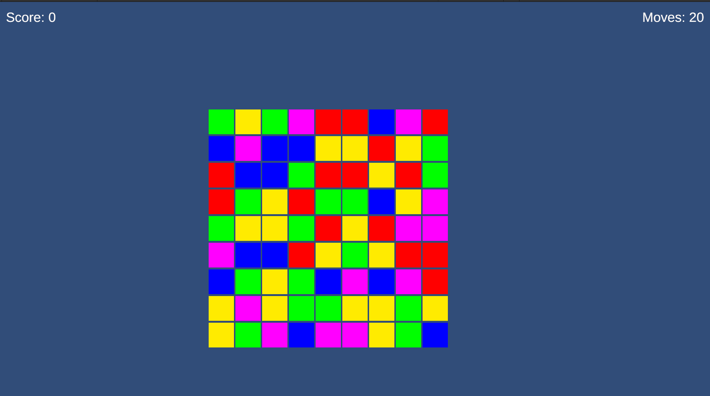
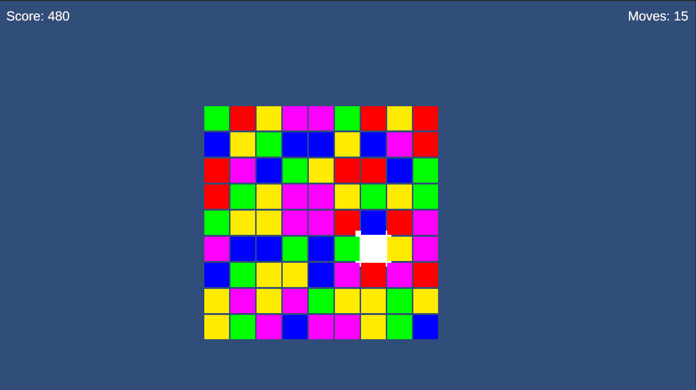
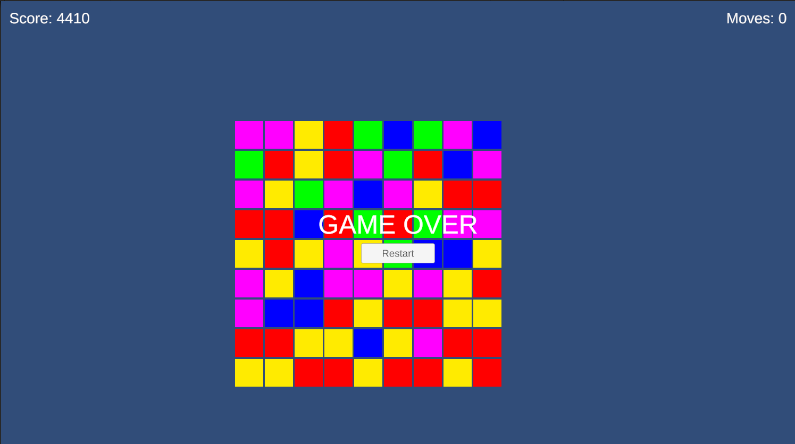

# Crystal Quest - Match-3 Puzzle Game

A 2D Match-3 puzzle game developed in **Unity 6** using **C#**. Players swap adjacent gems to create matches, trigger cascading chain reactions, generate special Volt Gems, and maximize their score within a limited number of moves.

---

## Features

- 🎮 9×9 Match-3 game board
- 🔄 Adjacent gem swapping
- ✅ Automatic horizontal and vertical match detection
- 🌊 Cascading chain reactions
- ⬇️ Gravity-based gem falling
- 💎 Automatic board refill
- ⚡ Special Volt Gem generated from 4-gem matches
- 📈 Score tracking system
- 🎯 20-move gameplay limit
- 🏁 Game Over screen
- 🔁 Restart button

---

## Technologies Used

- Unity 6.3 LTS
- C#
- TextMesh Pro
- Android Build Support

---

## Project Structure

```
Assets/
├── Scripts/
│   ├── Core/
│   ├── Gameplay/
│   ├── UI/
│   └── Utilities/
├── Scenes/
├── Prefabs/
├── Materials/

Packages/
ProjectSettings/
```

---

## How to Run

### In Unity

1. Clone this repository.
2. Open the project using **Unity 6.3 LTS**.
3. Open the scene:

```
Assets/Scenes/MainGame.unity
```

4. Press **Play**.

---

### Android

Install the provided APK on an Android device and launch the game.

---

## Gameplay

- Select two adjacent gems to swap them.
- Match three or more gems of the same color.
- Four-gem matches create a **Volt Gem**.
- Cascades continue automatically until the board becomes stable.
- Earn points for every successful match.
- The game ends after **20 moves**.

---
## Screenshots

### Game Start



---

### Gameplay



---

### Game Over



---

## Future Improvements

- Sound effects and background music
- Match animations and visual effects
- Additional special gems
- Multiple levels and increasing difficulty
- Leaderboard system

---

## Repository Contents

- Unity Source Code
- Android APK
- README
- Development Report

---

## Author

**Bhavya Posham**

---
